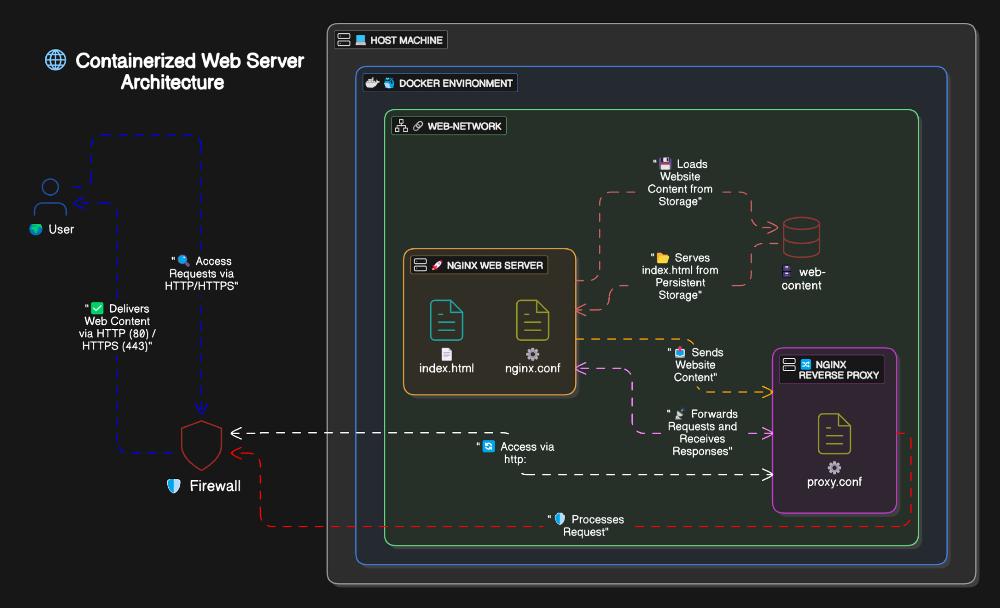

# Dockerizing an Nginx-Based Application with Reverse Proxy

## Prerequisites
Before proceeding, ensure the following dependencies are installed on your system:
- **Nginx** (installed)
- **Docker** (installed and running)

---

## Dockerized Web Server Architecture



---

## Step 1: Create a Dockerfile
A Dockerfile is required to define the Nginx container configuration. Create a `Dockerfile` with the following content:

```dockerfile
FROM nginx:latest
COPY index.html /usr/share/nginx/html/index.html
COPY nginx.conf /etc/nginx/nginx.conf
EXPOSE 80
CMD ["nginx", "-g", "daemon off;"]
```

### Explanation:
- `FROM nginx:latest` - Uses the latest Nginx official image as the base.
- `COPY index.html /usr/share/nginx/html/index.html` - Copies the website content into the container.
- `COPY nginx.conf /etc/nginx/nginx.conf` - Copies a custom Nginx configuration file.
- `EXPOSE 80` - Exposes port 80 for HTTP traffic.
- `CMD ["nginx", "-g", "daemon off;"]` - Runs the Nginx service in the foreground.

---

## Step 2: Build the Docker Image
Run the following command in the directory containing the Dockerfile:

```sh
docker build -t web-server .
```

### Explanation:
- `docker build` - Builds the Docker image.
- `-t web-server` - Tags the image as `web-server`.
- `.` - Specifies the current directory as the build context.

---

## Step 3: Create a Docker Volume
To persist website data, create a volume:

```sh
docker volume create web-data
```

### Explanation:
- `docker volume create web-data` - Creates a named volume `web-data` to store website content persistently.

---

## Step 4: Create a Docker Network
To enable communication between containers, create a network:

```sh
docker network create web-network
```

### Explanation:
- `docker network create web-network` - Creates a custom bridge network named `web-network`.

---

## Step 5: Run the Nginx Web Server Container
Launch the Nginx web server with the following command:

```sh
docker run -d -p 8080:80 --network web-network -v web-data:/usr/share/nginx/html --name web-server nginx
```

### Explanation:
- `docker run -d` - Runs the container in detached mode.
- `-p 8080:80` - Maps container’s port 80 to host’s port 8080.
- `--network web-network` - Connects the container to the custom Docker network.
- `-v web-data:/usr/share/nginx/html` - Mounts the volume for persistent storage.
- `--name web-server` - Assigns a name to the container.
- `nginx` - Uses the Nginx image.

---

## Step 6: Verify the Web Server
Test if the server is running using:

```sh
curl http://localhost:8080
```

You should see the default Nginx welcome page or your custom HTML page.

---

## Step 7: Add an HTML File to the Volume
To add a simple webpage, create an `index.html` file:

```sh
echo "<h1>Welcome to My Web Server</h1>" > index.html
```

Copy the file into the container:

```sh
docker cp index.html web-server:/usr/share/nginx/html/
```

### Explanation:
- `docker cp` - Copies files from the host machine into the container.
- `index.html` - The file to copy.
- `web-server:/usr/share/nginx/html/` - The destination inside the container.

---

## Step 8: Create a Reverse Proxy Configuration
Create a custom Nginx configuration file `nginx.conf` with the following content:

```nginx
server {
    listen 80;
    location / {
        proxy_pass http://backend-service:5000;
    }
}
```

This configuration sets up Nginx as a reverse proxy that forwards requests to a backend service running on port 5000.

---

## Step 9: Run the Reverse Proxy Container
Now, run the reverse proxy container:

```sh
docker run -d --name reverse-proxy -p 8081:80 --network web-network -v $(pwd)/nginx.conf:/etc/nginx/nginx.conf nginx
```

### Explanation:
- `docker run -d` - Runs the container in detached mode.
- `--name reverse-proxy` - Names the container `reverse-proxy`.
- `-p 8081:80` - Maps host port 8081 to container port 80.
- `--network web-network` - Connects it to the custom Docker network.
- `-v $(pwd)/nginx.conf:/etc/nginx/nginx.conf` - Mounts the custom configuration file inside the container.

---

## Step 10: Verify Reverse Proxy
Test if the reverse proxy is working:

```sh
curl http://localhost:8081
```

If a backend service is running at `backend-service:5000`, the request should be forwarded correctly.

---

## Conclusion
You have successfully dockerized an Nginx-based application with a reverse proxy. The setup includes:
- A web server container serving static content.
- A reverse proxy container forwarding requests.
- A persistent volume for website content.
- A custom Docker network for communication.

This architecture is suitable for deploying scalable web applications with a backend API service.

---

